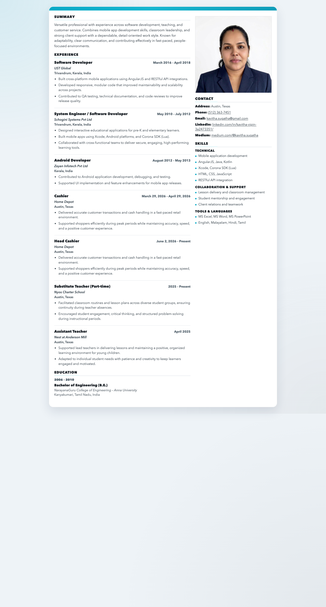

# Resume Builder

A frontend-only resume builder built with React, Zustand, Material UI, and jsPDF.

**Live app:** [kavitha-sugatha.github.io/resume-builder](https://kavitha-sugatha.github.io/resume-builder/)



The app lets users enter their resume details, upload a profile photo, preview the result in a clean two-column layout, and download a PDF when they are ready.

## Features

- Live resume editor for personal details, skills, work experience, and education
- Profile photo upload with immediate preview update
- Resume preview that mirrors the reference resume layout
- PDF export using jsPDF
- Responsive interface that works on desktop and mobile
- Simple, functional UI built with Material UI

## Tech Stack

- React 18
- Zustand for state management
- Material UI for the interface
- jsPDF for PDF generation
- Vite for local development and production builds

## Getting Started

### Prerequisites

- Node.js 18 or newer
- npm

### Install dependencies

```bash
npm install
```

### Start the development server

```bash
npm run dev
```

If Vite chooses a different port because one is already in use, open the URL it prints in the terminal.

### Build for production

```bash
npm run build
```

### Preview the production build

```bash
npm run preview
```

## Scripts

- `npm run dev` - Start the Vite dev server
- `npm run build` - Type-check and build the app
- `npm run preview` - Preview the production build locally

## How It Works

The app keeps all resume data in a Zustand store. The editor updates that store in real time, and the preview reads from the same data so changes appear immediately.

The PDF export uses jsPDF and includes the selected profile photo when the uploaded image is available as a data URL.

## Project Structure

- `src/App.tsx` - Main editor and resume preview UI
- `src/store.ts` - Zustand store and default resume data
- `src/pdf.ts` - PDF export logic
- `src/types.ts` - Shared TypeScript types
- `src/styles.css` - Global and preview styling
- `public/profile.jpg` - Default profile photo used by the preview

## Notes

- This is a frontend-only application.
- The preview is intentionally styled to match the reference resume layout closely.
- The repository is configured to push to the `kavitha-sugatha` GitHub SSH remote.

## Deploy to GitHub Pages

This project is already configured for GitHub Pages deployment using GitHub Actions.

1. Push changes to the `main` branch.
2. In the GitHub repository, open `Settings` > `Pages`.
3. Set the source to `GitHub Actions`.
4. Let the workflow in `.github/workflows/deploy.yml` build the app and publish the `dist` folder.

The Vite build base is set to `/resume-builder/`, which matches the repository name so asset paths work correctly on Pages.